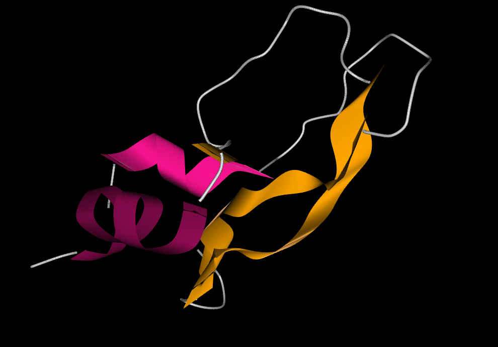
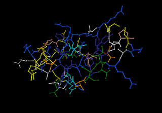

# PDB-Protein-Viewer
A Protein visualization Tool written in Java / JavaFX to display Proteins from PDB files.

  


## Build and Run

```
javac -cb ./src/MainApplication.java
java MainApplication
```
